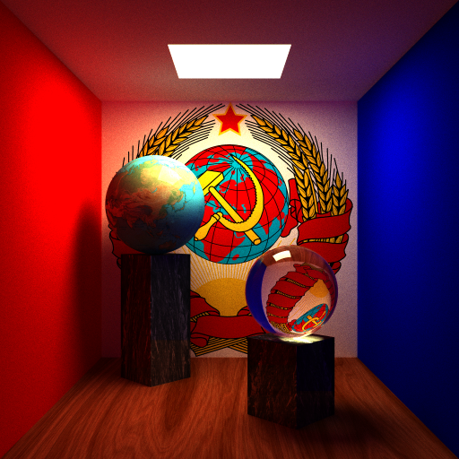
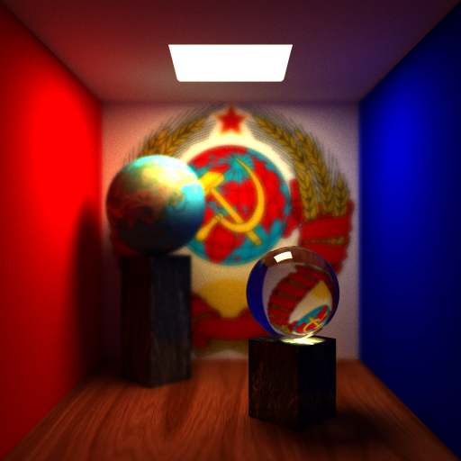
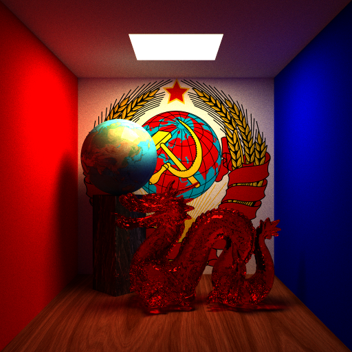
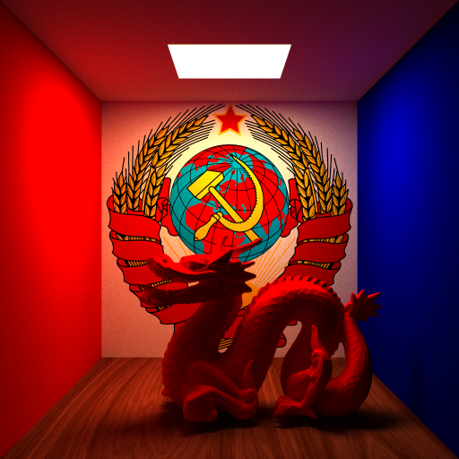

# Raytrace project of 2015-2016 Spring Basic of Computer Graphics

CST 45    Chuizheng Meng    2013010952

[TOC]

## Results

- Implemented the path tracing algorithm, finished the basic requirement, 4x over sampling anti-aliasing, simple objects, texture mapping, soft shadow, diffuse reflection/reflection/refraction

- Support for depth of field
    - A case where focal plane is near

    

    - A case where focal plane is in the distance

    

- Support for complicated objects accelerated with kdtree
    - A red dragon made in class without simplification

    

    - A red dragon made in diffuse reflection material, with simplification ratio as 0.1

    

## Project Structure

- main.cpp: main function and setting scene;
- camera.h, camera.cpp: the class of camera, implementing a camera and the support for depth of field;
- geometry.h, geometry.cpp: the class of object, implementing the algorithm calculating the intersection of simple and complex objects;
- scene.h, scene.cpp: the class of scene, implementing the path tracing algorithm.

## Implementation

### Path Tracing

I refered to lecture slides and the demo provided by [smallpt][smallpt].

Based on Monte Carlo's idea, the path tracing algorithm does not track only one ray when tracking rays. Instead, it randomly selects a ray according to the probability distribution of the BRDF function for tracking. The integration is approximately calculated by averaging multiple samples. The experiment uses the following three kinds of BRDF functions:

- diffuse reflection. The reflected light is equally probable in the hemisphere, without refracted light.
- Reflection. Reflected light is only present in the direction of incident light reflection, no refracted light.
- Refraction. There are both refracted and reflected rays. The proportion of light refraction/reflection is determined according to the Fresnel formula. When the light is incident on a medium with a refractive index of $n_a$ from a medium with a refractive index of $n_b$, the incident angle is $\theta At $, the ratio of light reflection is$Fr(\theta)=F_0+(1-F_0)(1-\cos\theta)^5$, where $F_0=\dfrac{(n-1)^2}{(n+1)^2}, n=\dfrac{n_a}{n_b}$. The ratio of refracted rays is $T=1-Fr(\theta)$.

First, the actual image size is calculated according to the requirements of 4x oversampling. When calculating, the position on the corresponding image plane is determined according to the pixel position, and then the algorithm cast a ray from the viewpoint to the point that is sampled. Each time the sample is added with some noise but kept in a pixel-sized area to ensure the average point. Each time of sampling, the algorithm tracks at least 5 times for one ray. When the number of times is > 5, the algorithm uses the roulette strategy to take the maximum reflectivity of the current material as the probability of continuing tracking.

### Depth of Field

I refered to [this][景深] article on Wikipedia.

According to the principle of depth of field, each point on the focal plane corresponds to a unique point on the image plane, which is the intersection of the point of view and the image plane on the focal plane. If a point P is not in the focal plane, then the intersection of the line, which connects P and the viewpoint, and the image plane is distributed on a circle, which is equivalent to randomly taking a point from a circle around the viewpoint to connect with P, and then intersecting the image plane to obtain a corresponding point. The position of the focal plane can determine where the scene is clear, the size of the circle around the viewpoint used to take points determines the blur/clearness of the rest of the scene. Therefore, it is only necessary to move the viewpoint to a point in a circle around it and then cast a ray towards the originally chosen point on the focal plane.

### kd-tree

Use kd-tree to organize the triangle slices of the obj file to speed up the intersection.

During the implementation process, I found that there are many cases in which the triangular patches exist both in the left and right children. If I naively do the division, the nodes may be redundant. Therefore, when the tree is built, the ratio of common nodes in the left and right children over the total number of nodes is used as a metric. If the ratio > 0.5, the division will not be performed, otherwise the division will be stopped until the maximum depth is reached.

The minimum distance between intersection points and the viewpoint is maintained during the query. If the intersection point of some object has a larger distance to the viewpoint, it is ignored.

[smallpt]: http://www.kevinbeason.com/smallpt/
[景深]: https://en.wikipedia.org/wiki/Depth_of_field
