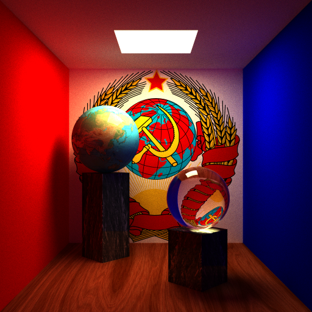
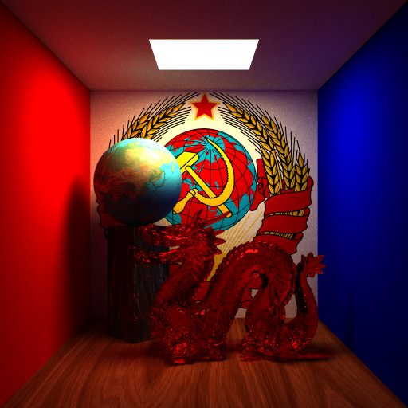

# 计算机图形学基础实验报告 光线跟踪

计45 孟垂正 2013010952

[TOC]

## 图片

- 路径跟踪方法, 实现了基本功能, 4x超采样抗锯齿, 简单形体, 贴图, 软阴影, 漫反射/反射/折射材质

- 添加了景深效果
    - 焦平面在近处

    

    - 焦平面在远处

    

- 复杂形体, 使用kdtree进行加速
    - 红色玻璃dragon, 未简化

    

    - 红色漫反射dragon, 简化比0.1

    

## 文件结构

- main.cpp: 主程序, 配置场景, 执行路径跟踪算法;
- camera.h, camera.cpp: 相机类, 实现了相机相关功能和景深效果, 用于在执行过程中投射光线;
- geometry.h, geometry.cpp: 物体类, 实现了简单形体(平面, 球, 矩形, 三角形)和复杂形体(三角面片组成的kdtree)的求交算法;
- scene.h, scene.cpp: 场景类, 实现了路径跟踪算法.

## 实现细节

### 路径跟踪算法

本部分的实现参考了课件和[smallpt][smallpt]提供的demo.

路径跟踪算法基于蒙特卡洛的思想, 在跟踪光线时不是跟踪一条光线, 而是根据BRDF函数的概率分布随机选取光线进行跟踪, 通过多次采样求平均的方式近似计算积分. 实验中用到的BRDF函数有3种:

- 漫反射. 反射光线在半球面内等概率分布, 无折射光线.
- 反射. 反射光线仅在入射光反射的方向存在, 无折射光线.
- 折射. 同时存在折射光线和反射光线. 光线折射/反射的比例根据菲涅尔公式确定. 当光线从折射率$n_a$的介质射入折射率$n_b$的介质, 入射角为$\theta$时, 光线发生反射的比率为$Fr(\theta)=F_0+(1-F_0)(1-\cos\theta)^5$, 其中$F_0=\dfrac{(n-1)^2}{(n+1)^2}, n=\dfrac{n_a}{n_b}$. 发生折射的比率$T=1-Fr(\theta)$.

首先根据4x超采样的要求计算实际图像尺寸. 计算时, 根据像素位置确定其对应像平面上位置, 然后发出从视点到该点的光线进行采样. 每次采样时对视点在一个像素大小的区域内加以扰动以保证平均取点. 每次采样时, 算法对一条光线至少跟踪5次, 当次数>5时, 算法采用轮盘赌策略, 以当前材料的最大反射率作为继续跟踪的概率.

### 景深效果实现

本部分的实现参考了[维基百科: 景深][景深].

根据景深的原理, 焦平面上的每个点对应于像平面上唯一点, 该点即为视点与焦平面上点连线和像平面的交点. 若某点不在焦平面上, 则其与视点连线和像平面的交点分布在一个圆上, 相当于从视点周围的一个圆上随机取点与该点连线, 再和像平面相交得到对应点. 焦平面的位置可以确定何处的景物清晰显示, 视点周围用于取点的圆的大/小决定了其余景物的模糊/清晰程度. 因此, 实现时只需将视点移动到其周围的一个圆内的某一点再对准焦平面上原来对准的点发出光线即可.

### kd-tree

使用kd-tree组织obj文件的三角面片以加速求交.

实现过程中发现三角面片在左右孩子中均存在的情况很多, 若简单进行划分可能造成节点大量重复出现. 因此在建树时将左右孩子中重复节点的数量作为阈值, 若重复节点占总节点的比例超过一半则不再进行划分, 否则直到达到最大深度后停止划分.

查询时维护截至当前求交结果的最小值, 查询时若某个包围盒求交的结果大于最小值则直接忽略之.

[smallpt]: http://www.kevinbeason.com/smallpt/
[景深]: https://zh.wikipedia.org/wiki/%E6%99%AF%E6%B7%B1